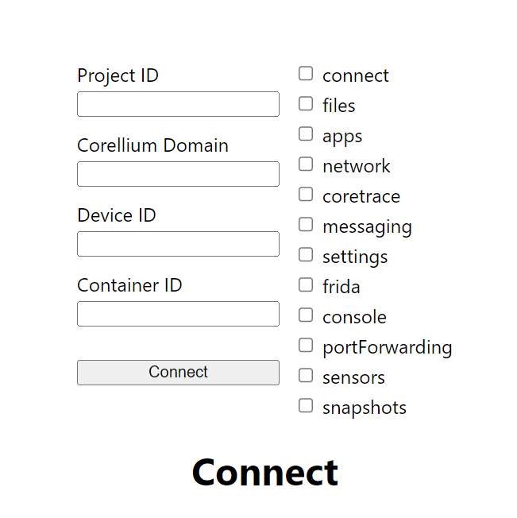

# Corellium Webplayer Client

The Corellium Webplayer Client allows you to host a Corellium device on your website.

## Prerequisites

Your domain must be allowed to use the Webplayer before you begin. Please contact
Corellium Sales to enable the Webplayer feature.

Once you have the feature activated on your account you would need to add allowed domains in the Profile section of your account


Your website will have to authenticate with Corellium's APIs using an API token.
You can generate an API token using the domain admin interface.

Your API token should be kept private and secure at all times.

To use the Webplayer you will need to exchange the API token for a JWT.

---

This is a [Next.js](https://nextjs.org/) project bootstrapped with [`create-next-app`](https://github.com/vercel/next.js/tree/canary/packages/create-next-app).

## Getting Started

### Installing the Corellium Webplayer

Install the [Webplayer package](https://www.npmjs.com/package/@corellium/corellium-webplayer).

```bash
npm install @corellium/corellium-webplayer
# or
yarn add @corellium/corellium-webplayer
```

### Running the Webplayer

After the package has been successfully installed, run the development server.

```bash
npm run dev
# or
yarn dev
```

### Configuring the Webplayer

The web server should start running on `localhost:3000`.

1. Click on the instantiated web server.
   

2. Add your enterprise domain endpoint then choose which features to include.

---

## Server-Side App Code

Add your API token and snapshot ID in order to create a project and instance, and then obtain a JWT.

```js
// pages/api/createDevice.ts

const flavor = 'iphone6';
const os = '12.5.6';
const apiToken = 'my_api_token'; // Add your API token
const endpoint = body.endpoint;
const snapshot = 'my_snapshot_id'; // Add your snapshot ID
```

```js
// pages/api/createSession.ts

const response = await fetch(LOGIN_URL, {
  method: 'POST',
  headers: {
    'Content-Type': 'application/json',
    Authorization: 'my_api_token', // Add your API token
  },
  body: JSON.stringify({
    instanceId,
    projectId,
    expiresIn: 18000, // value is in seconds, 18000 = 5 hours
    features: {
      ...defaultFeatures,
      ...features,
    },
  }),
});
```

---

## Client-side App Code

You can check out the example [client-side code](pages/index.tsx) for how to use the Webplayer in your app.

## Instantiating the Webplayer

Once you have a JWT you can now instantiate the Webplayer.

```js
// pages/index.tsx

import Webplayer from '@corellium/corellium-webplayer';

// now that we have a JWT, set up the Webplayer
// pass the id for the div that will hold the iframe as `containerId`
const webplayer = new Webplayer({
  token,
  domain: endpoint,
  deviceId: instanceId,
  containerId: 'container', // this id is matched with the div with the same id in the HTML
});
```

## Webplayer Events

The Webplayer will emit events when certain things occur, such as on successful startup or error.

You can use the `.on()` method to register event listeners (one listener callback per event type).

```js
webplayer.on('success', (data) => {
  console.log('data', data);
});

webplayer.on('error', (data) => {
  console.error('err', data);
});
```

## Sample Code

You can view the sample code in the [pages folder](pages) in this repository.
