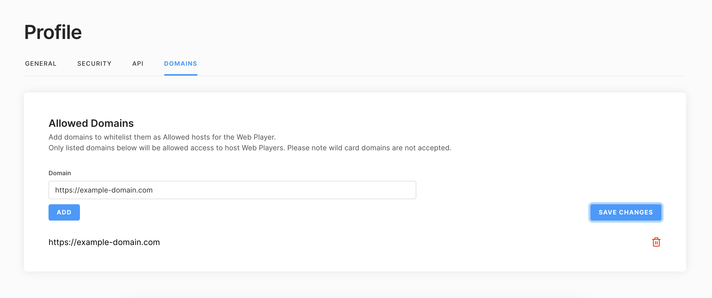

# Corellium Webplayer Client

The Corellium Webplayer Client allows you to host a Corellium device on your website.

## Prerequisites

Your domain must be allowed to use the Webplayer before you begin. Please contact
Corellium Sales to enable the Webplayer feature.

Once you have the feature activated on your account you would need to add allowed domains in the Profile section of your account



Your website will have to authenticate with Corellium's APIs using an API token.
You can generate an API token using the domain admin interface.

Your API token should be kept private and secure at all times.

In order to use the Webplayer you will need to exchange the API token for a JWT.

---

This is a [Next.js](https://nextjs.org/) project bootstrapped with [`create-next-app`](https://github.com/vercel/next.js/tree/canary/packages/create-next-app).

## Getting Started

First install the Corellium webplayer [package](https://www.npmjs.com/package/@corellium/corellium-webplayer)

```bash
npm install @corellium/corellium-webplayer
# or
yarn add @corellium/corellium-webplayer
```

Then run the development server:

```bash
npm run dev
# or
yarn dev
```

## Server-side app code

You can use code similar to this to convert your API token to a JWT for the user to authenticate with the Webplayer.

```js
// pages/api/auth.ts

import type { NextApiRequest, NextApiResponse } from 'next';

type Data = {
  method?: string;
  error?: string;
};

const LOGIN_URL = 'https://ci-1.corellium.co/api/v1/webplayer';

export default async function handler(
  req: NextApiRequest,
  res: NextApiResponse<Data>
) {
  const { token, projectId, instanceId, features } = req.body;

  if (!token || !projectId || !features || !instanceId) {
    res.status(400).json({ error: 'Missing required parameters' });
    return;
  }

  if (req.method === 'POST') {
    try {
      const response = await fetch(LOGIN_URL, {
        method: 'POST',
        headers: {
          'Content-Type': 'application/json',
          'Authorization': token,
        },
        body: JSON.stringify({
          projectId,
          instanceId,
          expiresIn: 18000,
          features,
        }),
      });

      const data = await response.json();

      res.status(200).json(data);

      return;
    } catch (err: unknown) {
      console.log('webplayer ERROR: ', err);
      throw new Error('ERROR getting token from the server');
    }
  }

  res.status(200).json({ method: 'API only support POST requests' });
}

```

## Client-side app code

You can check out the example [client side code](pages/index.tsx) for how to use the Webplayer in your app.

## Obtaining the JWT

Your app code should create a request to obtain a JWT.

```js
// pages/index.tsx

// get JWT using token
const res = await fetch('/api/auth', {
  method: 'POST',
  headers: {
    'Content-Type': 'application/json',
  },
  body: JSON.stringify({
    token: process.env.ACCESS_TOKEN,
    projectId: 'You project ID',
    instanceId: 'Your device ID',
    features: 'You requested features',
  }),
});
const { token, ...data } = await res.json();
```

## Instantiating the Webplayer

Once you have a JWT you can now instantiate the Webplayer.

```js
// pages/index.tsx

import Webplayer from '@corellium/corellium-webplayer';

// now that we have a JWT, set up the webplayer
// pass the id for the div that will hold the iframe as `containerId`
const webplayer = new Webplayer({
  token,
  domain: 'Corellium domain to connect to',
  deviceId: 'Your device ID',
  containerId: 'Your container ID (html element id)',
});
```

## Webplayer Events

The Webplayer will emit events when certain things occur, such as on successful startup or error.

You can use the `.on()` method to register event listeners (one listener callback per event type).

```js
webplayer.on('success', (data) => {
  console.log('data', data);
});

webplayer.on('error', (data) => {
  console.error('err', data);
});
```

## Sample Code

You can view the sample code in the [pages folder](pages) in this repository.
