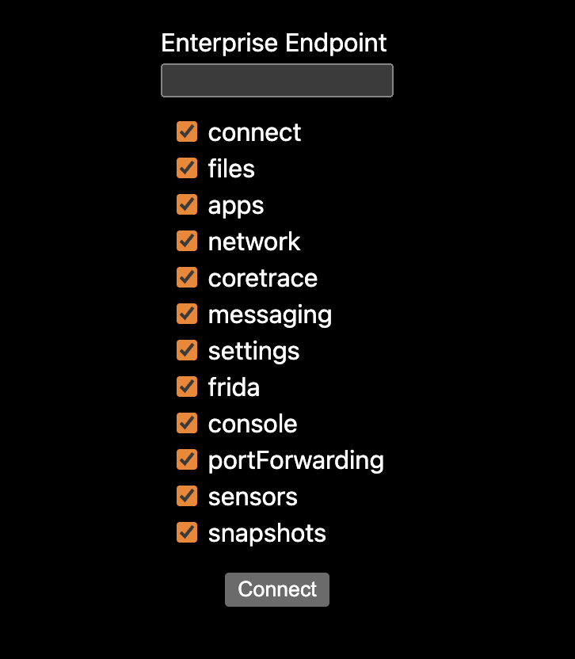

# Corellium Webplayer Client

The Corellium Webplayer Client allows you to host a Corellium device on your website.

## Prerequisites

Your domain must be allowed to use the Webplayer before you begin. Please contact
Corellium Sales to enable the Webplayer feature.

Once you have the feature activated on your account you would need to add allowed domains in the Profile section of your account


Your website will have to authenticate with Corellium's APIs using an API token.
You can generate an API token using the domain admin interface.

Your API token should be kept private and secure at all times.

To use the Webplayer you will need to exchange the API token for a JWT.

---

This is a [Next.js](https://nextjs.org/) project bootstrapped with [`create-next-app`](https://github.com/vercel/next.js/tree/canary/packages/create-next-app).

## Getting Started

### Installing the Corellium Webplayer

Install the [Webplayer package](https://www.npmjs.com/package/@corellium/corellium-webplayer).

```bash
npm install @corellium/corellium-webplayer
# or
yarn add @corellium/corellium-webplayer
```

### Running the Webplayer

After the package has been successfully installed, run the development server.

```bash
npm run dev
# or
yarn dev
```

### Configuring the Webplayer

The web server should start running on `localhost:3000`.

1. Click on the instantiated web server.
   

2. Add your enterprise domain endpoint then choose which features to include.

---

## Server-Side App Code

There are two sections of server-side code that you will need to implement in your app.

First section is to create a project, assign cores to it and create an instance using s snapshot.

Second section is to exchange the API token for a JWT and start a web player session.

### Creating a Project and Instance

For this part you'd need to add your API token and snapshot ID to the code below.

```js
// pages/api/createDevice.ts

import { NextApiHandler } from 'next';
import { Corellium } from '@corellium/corellium-api';

const handler: NextApiHandler = async (req, res) => {
  const body = typeof req.body === 'string' ? JSON.parse(req.body) : req.body;
  if (!body.endpoint) {
    throw new Error('Missing required parameters');
  }
  const flavor = 'iphone6';
  const os = '12.5.6';
  const apiToken = 'my_api_token'; // Add your API token
  const endpoint = body.endpoint;
  const snapshot = 'my_snapshot_id'; // Add your snapshot ID

  try {
    const corellium = new Corellium({
      endpoint,
      apiToken,
    });

    const project = await corellium.createProject('Webplayer Project');

    await project.setQuotas({
      cores: 2,
    });

    const instance = await project.createInstance({
      name: 'Webplayer Device',
      flavor,
      os,
      bootOptions: {
        snapshot,
      },
    });

    res.status(200).json({
      instanceId: instance.id,
      projectId: project.id,
    });
  } catch (error: any) {
    console.error(error);
    res.status(500).json({ error: `ERROR creating device: ${error.message}` });
  }
};

export default handler;

```

### Exchange API token for JWT

You can use code similar to below code to convert your API token to a JWT for the user to authenticate with the Webplayer.

For this section you'd need to add your API token to the authorization header of the fetch request.

```js
// pages/api/createSession.ts

import type { NextApiRequest, NextApiResponse } from 'next';

type Data = {
  method?: string;
  error?: string;
};

const defaultFeatures = {
  powerManagement: true,
  deviceControl: true,
  deviceDelete: true,
  profile: true,
  images: true,
  netmon: true,
  strace: true,
  system: true,
};

export default async function handler(
  req: NextApiRequest,
  res: NextApiResponse<Data>
) {
  const body = typeof req.body === 'string' ? JSON.parse(req.body) : req.body;

  const { instanceId, projectId, domain, features } = body;

  const LOGIN_URL = `${domain}/api/v1/webplayer`;

  if (!projectId) {
    res.status(400).json({ error: 'Missing required parameters' });
    return;
  }

  if (req.method === 'POST') {
    try {
      const response = await fetch(LOGIN_URL, {
        method: 'POST',
        headers: {
          'Content-Type': 'application/json',
          Authorization: 'my_api_token', // Add your API token
        },
        body: JSON.stringify({
          instanceId,
          projectId,
          expiresIn: 18000,
          features: {
            ...defaultFeatures,
            ...features,
          },
        }),
      });

      const data = await response.json();

      res.status(200).json(data);

      return;
    } catch (err: unknown) {
      console.log('ERROR creating session: ', err);
      res.status(500).send({ error: 'ERROR getting token from the server' });
    }
  }

  res.status(200).json({ method: 'API only support POST requests' });
}
```

---

## Client-side App Code

You can check out the example [client-side code](pages/index.tsx) for how to use the Webplayer in your app.

## Obtaining the JWT

Your app code should create a request to create a project and then obtain a JWT.

### Create a Project code

```js
const handleCreateDevice = async () => {
  setText('Creating device...');

  try {
    const createdDevice = await fetch('/api/createDevice', {
      method: 'POST',
      headers: {
        'Content-Type': 'application/json',
      },
      body: JSON.stringify({
        endpoint,
      }),
    });

    setText('Device created successfully');

    const json = await createdDevice.json();

    handleCreateSession(json.projectId, json.instanceId);
  } catch (error) {
    console.error(error);
    setText('Error creating device!');
  }
};
```

### Create a session and obtain JWT token

```js
  const handleCreateSession = async (projectId: string, instanceId: string) => {
    setText('Getting token...');

    try {
      setText('Getting token...');
      // get JWT using access token
      const res = await fetch('/api/createSession', {
        method: 'POST',
        headers: {
          'Content-Type': 'application/json',
        },
        body: JSON.stringify({
          domain: endpoint,
          projectId,
          instanceId,
          features,
        }),
      });
      const { token, ...data } = await res.json();
      console.log('received JWT', token, data);
    }
  }
```

## Instantiating the Webplayer

Once you have a JWT you can now instantiate the Webplayer.

```js
// pages/index.tsx

import Webplayer from '@corellium/corellium-webplayer';

// now that we have a JWT, set up the Webplayer
// pass the id for the div that will hold the iframe as `containerId`
const webplayer = new Webplayer({
  token,
  domain: endpoint,
  deviceId: instanceId,
  containerId: 'container', // this id is matched with the div with the same id in the HTML
});
```

## Webplayer Events

The Webplayer will emit events when certain things occur, such as on successful startup or error.

You can use the `.on()` method to register event listeners (one listener callback per event type).

```js
webplayer.on('success', (data) => {
  console.log('data', data);
});

webplayer.on('error', (data) => {
  console.error('err', data);
});
```

## Sample Code

You can view the sample code in the [pages folder](pages) in this repository.
