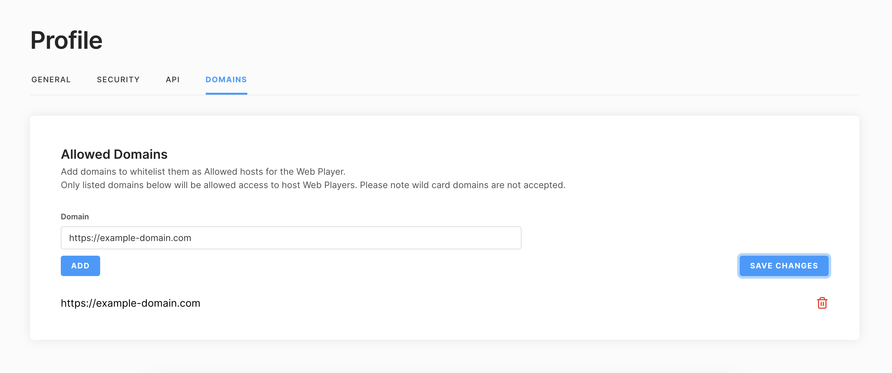

# Corellium Webplayer Client

The Corellium Webplayer Client allows you to host a Corellium device on your website.

## Prerequisites

Your domain must be allowed to use the Webplayer before you begin. Please contact
Corellium Sales to enable the Webplayer feature.

Once you have the feature activated on your account you would need to add allowed domains in the Profile section of your account



Your website will have to authenticate with Corellium's APIs using an API token.
You can generate an API token using the domain admin interface.

Your API token should be kept private and secure at all times.

In order to use the Webplayer you will need to exchange the API token for a JWT.
You can do this by creating an API proxy in Express.js or another server-side language.

## Server-side app code

You can use code similar to this to convert your API token to a JWT for the user to authenticate with the Webplayer.

```js
app.post('/api/auth', jsonParser, async (req, res) => {
  const loginUrl = new URL('/api/v1/webplayer', 'https://your-domain.corellium.com').href;

  const httpsAgent = new https.Agent({
    rejectUnauthorized: false,
  });

  try {
    const response = await fetch(loginUrl, {
      method: 'POST',
      headers: {
        'Content-Type': 'application/json',
        // your API token
        Authorization: req.body.token,
      },
      body: JSON.stringify({
        // you must create the project and instance first before you can use the Webplayer
        // you can use the Corellium website or API to do this.
        projectId: req.body.projectId,
        instanceId: req.body.instanceId,
        expiresIn: 60 * 60 * 5, // value is in seconds
        // a list of features you would like enabled in the Webplayer
        features: req.body.features,
      }),
      agent: httpsAgent,
    });

    const data = await response.json();

    res.send(data);

    return;
  } catch (err) {
    console.log('webplayer ERROR: ', err);
  }
});
```

## HTML Setup

Your HTML should include an element to contain the Corellium iframe. An example is shown below.

When the iframe is loaded it will replace the contents of "container" div with the Corellium Webplayer webpage.

You can include code that handles loading and error conditions.

```html
<head>
  <!-- app.js will contain the client JS code -->
  <script src="app.js" type="module"></script>
  <script src="https://unpkg.com/@corellium/corellium-webplayer@1.0.11/dist/index.global.js"></script>
</head>
<body>
  <h2>Demo</h2>
  <div id="container">
    <div id="corellium-loading">
      <h1>Loading...</h1>
    </div>
    <div id="corellium-error" style="display: none">
      <h1>Error</h1>
    </div>
  </div>
</body>
```

## Obtaining the JWT

Your app code should create a request to obtain a JWT.

```js
// get JWT using token
const res = await fetch('http://localhost:8000/api/auth', {
  method: 'POST',
  headers: {
    'Content-Type': 'application/json',
  },
  body: JSON.stringify({
    token: apiToken,
    projectId,
    instanceId,
    features,
  }),
});

const { token, ...data } = await res.json();
```

## Instantiating the Webplayer

Once you have a JWT you can now instantiate the Webplayer.

```js
// now that we have a JWT, set up the webplayer
// pass the id for the div that will hold the iframe as `containerId`

const CorelliumWebplayer = window.CorelliumWebplayer.default;

const webplayer = new corelliumWebplayer({
  token,
  domain: corelliumDomain,
  deviceId,
  containerId,
});
```

## Webplayer Events

The Webplayer will emit events when certain things occur, such as on successful startup or error.

You can use the `.on()` method to register event listeners (one listener callback per event type).

```js
webplayer.on('success', (data) => {
  console.log('data', data);
});

webplayer.on('error', (data) => {
  console.error('err', data);
});
```

## Sample Code

You can view the sample code in the [public folder](public) in this repository.
